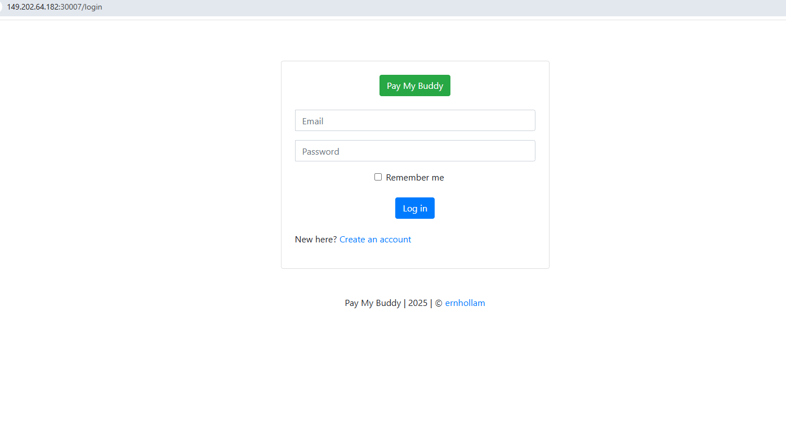

# Configuration de PayMyBuddy

Ce repository contient les configurations nécessaires pour déployer l'application **PayMyBuddy** à l'aide de Docker Compose et Kubernetes. Voici un aperçu des différents fichiers et leur rôle dans l'architecture globale.

---

## Table des Matières
1. [Docker Compose](#docker-compose)
2. [Déploiement Kubernetes](#déploiement-kubernetes)
   - [Backend Deployment](#backend-deployment)
   - [Base de Données (MySQL)](#base-de-données-mysql)
3. [ConfigMap](#configmap)
4. [Secret](#secret)
5. [Services](#services)
6. [Persistent Volume Claim (PVC)](#persistent-volume-claim-pvc)

---

## Docker Compose

### Fichier : `dockercompose`  
Ce fichier décrit une stack basique avec **Docker Compose**. 

- **Services** :
  - **paymybuddy-backend** : Conteneur contenant l'application backend Spring Boot.  
    - Utilise l'image `punkgrb/paymybuddy-backend:latest`.
    - Expose un port configurable via une variable d'environnement (`APP_PORT`).
    - Se connecte à la base de données avec les informations d'environnement (`SPRING_DATASOURCE_*`).
  - **paymybuddy-db** : Base de données MySQL.  
    - Utilise l'image Docker `mysql:8`.
    - Un volume persiste les données dans le chemin `/var/lib/mysql`.
    - Initie la base de données avec des scripts se trouvant dans `/home/debian/initdb`.

- **Volumes** :
  - `db_data` : Persistance des fichiers de données pour MySQL.

---

## Déploiement Kubernetes

### Backend Deployment

#### Fichier : `paymybuddy-backend-deployment.yaml`
Définit le déploiement du backend avec **Kubernetes** :
- Déploie deux replicas pour garantir la redondance et la haute disponibilité.
- Utilise les configurations suivantes :
  - Les variables d'environnement (comme `APP_PORT` et `SPRING_DATASOURCE_*`) proviennent du **ConfigMap** et du **Secret**.
- Assigne le conteneur backend à un port interne `8080`.

---

### Base de Données (MySQL)

#### Fichier : `paymybuddy-db-deployment.yaml`
Définit le déploiement de la base de données MySQL :
- Réplications fixées à `1` (pas de base de données distribuée ici).  
- Variable d'environnement pour MySQL : 
  - **Mot de passe root** : Extrait d'un secret Kubernetes pour plus de sécurité.
  - **Base de données** et **utilisateur** prédéfinis.
- Déploie des volumes pour :
  - La persistance des données (via un PVC).
  - L'initialisation de la base avec des scripts via un `ConfigMap`.

---

## ConfigMap

#### Fichier : `paymybuddy-configmap.yaml`
Le ConfigMap stocke des variables non sensibles nécessaires pour le déploiement, telles que :
- `APP_PORT` : Le port exposé par l'application backend.
- `SPRING_DATASOURCE_URL` : URL de la connexion MySQL (exemple : `jdbc:mysql://paymybuddy-db:3306/db_paymybuddy`).
- `SPRING_DATASOURCE_USERNAME` : Nom d'utilisateur pour la base MySQL.

---

## Secret

#### Fichier : `paymybuddy-secret.yaml`
Le Secret contient des données sensibles encodées en Base64, comme :
- `MYSQL_ROOT_PASSWORD` : Mot de passe root d'administration MySQL.
- `MYSQL_PASSWORD` : Mot de passe pour l'utilisateur principal MySQL utilisé par le backend.

---

## Services

#### Fichier : `paymybuddy-service.yaml`
Le service expose le backend à l'intérieur ou à l'extérieur du cluster :
- **Backend Service** :
  - Type : `ClusterIP` dans la majorité des cas pour les communications internes.
  - Configure les `ports` entre le conteneur et l'extérieur.
- **Exposition Publique** (optionnelle) :
  - Défini comme service de type `NodePort`.
  - Le backend sera accessible via un port Node précis (par exemple, `30007`).

#### Fichier : `paymybuddy-db-service.yaml`
Expose la base de données MySQL uniquement à l'intérieur du cluster Kubernetes, permettant au conteneur `paymybuddy-backend` de communiquer avec le conteneur de la base de données.

---

## Persistent Volume Claim (PVC)

#### Fichier : `mysql-pvc.yaml`
Le PVC alloue un volume persistant :
- Mode d'accès `ReadWriteOnce` : Le volume est utilisé par un seul noeud à la fois.
- Capacité : 5 Go.
- Assure la persistance des données MySQL en cas de redémarrage du pod.

---

## Interface Utilisateur

L'image ci-dessous montre à quoi ressemble l'interface de connexion de l'application **PayMyBuddy** après un déploiement réussi.

--- 
